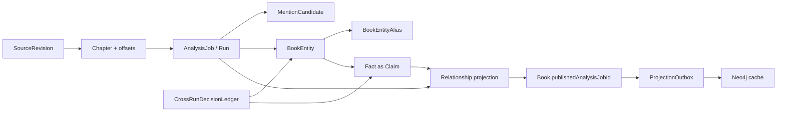
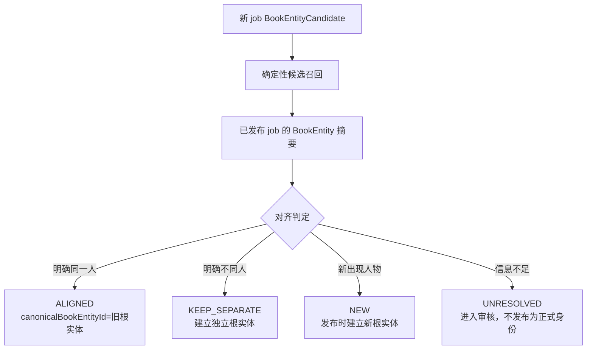
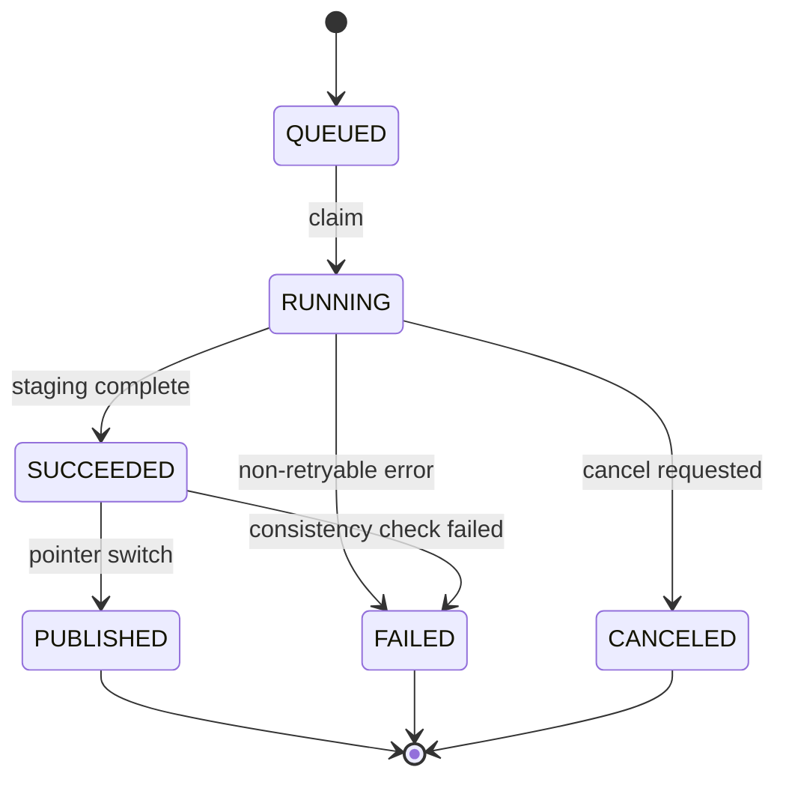

# 文渊 · v8-Core 轻量证据优先架构

> 状态：目标架构，尚未实现。
>
> 本文档是当前 v7 的**轻量增量目标**，不是一次性重写方案。当前代码审查见 `docs/architecture/architecture-review.md`，当前实现说明见 `docs/architecture/current-architecture.md`。
>
> 核心目标：用最少的结构改动解决四类已经发生的真实问题：重跑污染、跨书身份污染、证据不可验证、实体召回不足。

## 1. 结论

当前 v7 的逐章提取、紧凑名单身份 Pass 和确定性编排可以保留，但以下边界不能继续妥协：

```text
一次任务必须隔离
书内身份必须闭合
证据必须可定位和可验证
人物提及不能被事实抽取强行过滤
当前发布图谱不能被失败任务破坏
```

v8-Core 不一次性引入完整企业级版本平台。它采用现有 `AnalysisJob` 作为 run 边界，复用现有 `Fact` 作为 Claim 记录，复用现有审核状态和审计表，仅新增必要的书内实体、候选提及、原文 revision 和发布指针。

近期已经完成的截断重试、复用实体补建档、Neo4j hostname 和章节成功状态修复，属于运行时止血措施。它们改善了本次任务的可运行性，但不替代 v8-Core 的任务隔离、书内身份和证据边界。

## 2. 硬边界与暂缓范围

### 2.1 现在必须实现

| 优先级 | 边界 | 轻量实现 |
|---|---|---|
| P0 | Run staging 隔离 | 复用 `AnalysisJob` 作为 run，所有新事实和投影带 job scope |
| P0 | 书内身份边界 | 新增 `BookEntity`，解析阶段禁止按全局 Entity.name 复用 |
| P0 | Evidence 可验证 | SourceRevision + evidence offset/hash；Fact 保留 evidence 文本兼容字段 |
| P0 | Mention-only 召回 | 新增轻量 `MentionCandidate`，不要求人物先参与关系或事件 |
| P0 | 最小发布指针 | `Book.publishedAnalysisJobId`，失败任务不得改变当前指针 |
| P1 | 图缓存解耦 | `ProjectionOutbox` 异步同步 Neo4j，PostgreSQL 可独立工作 |
| P1 | 运行时结构校验 | Zod 校验 extraction 输出和 Fact payload，不新增专门数据表 |
| P1 | 基础任务保护 | 同书活动任务互斥、终态 CAS、stale RUNNING 恢复 |

### 2.2 明确暂缓

| 暂缓项 | 原因 | 未来触发条件 |
|---|---|---|
| 完整 PublicationVersion 历史 | 当前只需要一个发布指针 | 需要版本对比、用户回滚或多版本并存 |
| SkillRevision 表 | 当前 Skill 编辑频率低，新增版本域成本高 | 需要 Skill 历史、A/B、回滚或多人协作 |
| 完整 ClaimCandidate 表 | 现有 Fact 可以承载 staging Claim | Fact payload/状态无法继续扩展时 |
| 完整 ReviewDecision 事件表 | v8-Core 只新增跨 run 决策账本，不建设全量事件溯源 | 需要任意时间点重放所有审核状态时 |
| 分布式 lease/heartbeat | 当前先保证单机任务安全 | 多实例 Worker 或长期运行任务上线 |
| 全量事件溯源 | 当前审计需求可由现有 audit + 快照满足 | 需要任意时间点重放所有状态时 |

**暂缓不等于删除。** 暂缓项必须在数据模型中留下可扩展边界，不能用临时全局字段破坏未来迁移。

### 2.3 实施前必须锁定的执行约束

以下约束不是后续优化项，而是 v8-Core 能否保持数据正确性的验收条件：

| 编号 | 风险 | v8-Core 的硬性处理 |
|---|---|---|
| E1 | Evidence 只证明名字出现，不能证明 Claim 成立 | Fact 必须区分 `ANCHORED` 与 `SUPPORTED`；自动接受和发布都不能只依赖名字/offset 命中 |
| E2 | Claim/Entity 的跨 run 决定在重跑后丢失、冲突或被低优先级结果覆盖 | 使用统一的 `CrossRunDecisionLedger`；Claim 和 Entity 共用唯一键、来源、优先级、版本和 supersedes 链，新 job 按 `basePublishedJobId` 显式继承，不能按 Fact ID 复制 |
| E3 | DRAFT/UNRESOLVED 数据可能进入公开投影 | 发布资格必须有唯一谓词；未达到发布资格的 Fact、BookEntity 和 MentionCandidate 只能留在 staging/review |
| E4 | BookEntity 替换 EntityProfile 后丢失人物资料和布局 | 书内摘要、官职、标签、视觉配置、首次出场等字段必须迁移到 BookEntity 或明确的 BookEntityProfile；EntityProfile 只能是兼容投影 |
| E5 | 规范化定位后的 offset 无法还原原文位置 | 统一 source revision 坐标协议，并保存规范化文本到原文坐标的映射；所有 offset 使用同一坐标系 |
| E6 | stale recovery 后旧 Worker 仍能写数据 | 每次执行必须有 fencing token/epoch；所有 staging 写入校验 token，旧 Worker 只能被拒绝 |
| E7 | 章节范围 job 可能被误当作完整 job 发布 | Phase 1 先禁止局部 job 发布；完整合并算法和 `PARTIAL_NOT_PUBLISHABLE` 状态未实现前不得切换发布指针 |
| E8 | 延迟 Outbox 可能把旧 job 覆盖到 Neo4j | Outbox 必须携带发布代次；worker 写入前确认仍是当前 published job，过期 outbox 只能标记为 stale |
| E9 | 重试或崩溃后同一片段重复写入 | 持久化 segment/input hash/fingerprint/attempt，并建立数据库唯一约束，不能只在代码中声明幂等 |

`CrossRunDecisionLedger` 是唯一的跨 run 决策账本，至少包含：

```text
id
bookId
subjectType          -- ENTITY / CLAIM
decisionKey          -- 规范化的唯一匹配键
decisionVersion
decision              -- ALIGNED / KEEP_SEPARATE / ACCEPT / REJECT / UNRESOLVED
source                -- MANUAL / SECOND_MODEL / DETERMINISTIC / LLM
priority
payload
evidenceRefs
supersedesId?
decidedBy?
decidedAt
```

账本采用追加写，不覆盖历史决定；`(bookId, subjectType, decisionKey, decisionVersion)` 唯一，当前版本必须可唯一解析。优先级固定为 `MANUAL > SECOND_MODEL > DETERMINISTIC > LLM`，低优先级结果不能覆盖已确认决定。Entity 决定按 `canonical root + candidate fingerprint` 匹配，Claim 决定按 `claim fingerprint + canonical endpoints + evidence span` 精确匹配，不能用一种模糊规则覆盖两类对象。

语义支持采用分层门控：所有 Fact 先经过代码侧信号表得到 `ANCHORED` 或 `UNSUPPORTED`；只有高风险关系、代码信号冲突或无法确定的 Claim 才进入第二模型/人工，成功后写 `SUPPORTED` 及 `supportMethod`。低风险且代码信号完整的 Claim 可以走确定性 `SUPPORTED`，不对全量 Fact 调用第二模型。

状态语义也必须固定：`READY_TO_PUBLISH` 是发布前一致性检查结果，不强制新增 AnalysisJob 状态；`PUBLISHED` 由 `Book.publishedAnalysisJobId = job.id` 派生；`QUARANTINED` 属于 Fact/Evidence 或 ExtractionAttempt，而不是任务终态；局部任务使用独立的 `publishability` 标记。这样可以复用现有 `QUEUED/RUNNING/SUCCEEDED/FAILED/CANCELED` 状态，避免状态图和 Prisma 枚举分裂。

## 3. 总体架构

### 3.1 端到端流程图

```mermaid
flowchart TD
    A[导入/确认原文] --> B[创建 SourceRevision
source_hash + normalization_version]
    B --> C[生成 Chapter offset manifest]
    C --> D[创建 AnalysisJob
作为一次 AnalysisRun]
    D --> E[快照模型 Prompt Skill hash 关系契约]
    E --> F[预扫描候选
只提高召回]
    F --> G[逐章/逐段 Extraction]
    G --> H{Zod Schema 校验}
    H -- 失败 --> I[记录 attempt 错误
重试或失败片段]
    H -- 成功 --> J[写入 MentionCandidate + Fact(DRAFT)]
    J --> K[Evidence offset/hash 校验]
    K -- 失败 --> L[QUARANTINED
保留原始输出和原因]
    K -- 成功 --> M[创建 BookEntity 候选]
    M --> N[身份 Pass
仅在当前书/当前 job 内归并]
    N --> N2[跨 run 对齐
已发布实体召回 + ALIGNED/NEW/KEEP_SEPARATE/UNRESOLVED]
    N2 --> O[关系码/方向/类型校验]
    O --> P[自动接受或进入现有审核队列]
    P --> Q[按 job 构建 Relationship 投影]
    Q --> R{发布前一致性检查}
    R -- 失败 --> S[AnalysisJob FAILED
保留旧发布图谱]
    R -- 成功 --> T[事务切换 Book.publishedAnalysisJobId]
    T --> U[创建 ProjectionOutbox]
    U --> V[Neo4j 异步同步]
    T --> W[前端按 publishedAnalysisJobId 读取]
```

### 3.2 数据边界图



### 3.3 逻辑概念分离与物理表控制

v8-Core 必须完成概念分离，但不强制每个概念都新建一张表：

| 逻辑概念 | v8-Core 物理承载 |
|---|---|
| AnalysisRun | 复用 `AnalysisJob` |
| ClaimCandidate | 复用 `Fact`，增加 run/evidence 字段和严格状态语义 |
| MentionCandidate | 新增一张轻量表 |
| BookEntityCandidate | `BookEntity` 表，按 job 生成 staging 实体 |
| CrossRunDecisionLedger | 新增轻量决策账本，统一承载 Entity 对齐和 Claim 审核的跨 run 决定 |
| IdentityDecision | 账本中的 `subjectType=ENTITY` 投影；不得只依赖全局 Entity 合并建议 |
| ReviewDecision | 账本中的 `subjectType=CLAIM` 投影；必须能被后续 job carry-forward |
| PublicationVersion | 先复用 `Book.publishedAnalysisJobId` |
| RelationshipProjection | 复用 `Relationship`，增加 job scope |
| SkillRevision | 暂不建表，保存 hash/快照 |
| Outbox | P1 新增 `ProjectionOutbox`，带 publication generation |

## 4. 最小数据模型调整

### 4.1 `SourceRevision`

新增不可变原文版本表：

```text
id
bookId
sourceFileKey
sourceHash
normalizationVersion
normalizedTextHash
normalizedCharCount
createdAt
```

`SourceRevision` 对应的原文对象必须按内容 hash 不可变保存，不能只依赖可能被覆盖的 `Book.sourceFileKey`。v8-Core 统一使用 **0-based、半开区间 `[start, end)`、UTF-16 code unit** 作为应用层坐标；offset 均相对于该 revision 的规范化全文。若规范化会删除或替换字符，必须同时保存规范化文本到原文坐标的映射，不能直接使用规范化字符串下标。

现有 `Chapter` 增加或关联：

```text
sourceRevisionId
startOffset
endOffset
contentHash
```

`confirmBookChapters` 不再物理删除旧章节作为唯一行为，而是创建新的 SourceRevision/章节视图。旧数据可以继续保留，迁移期不要求立刻重构所有历史章节。

章节必须能唯一确定其 `sourceRevisionId`。若继续复用 `Chapter` 表，联合唯一键必须包含 revision；若保留旧的 `(bookId, type, no)` 语义，则应新增不可变的 revision chapter 表，不能用同一个 `chapterId` 覆盖多个原文版本。历史 Fact 若没有 revision/offset，只能标记为 `LEGACY_UNVERIFIABLE`，不能伪造新的证据坐标。

### 4.2 `AnalysisJob` 作为 Run

不新增 `AnalysisRun` 表。现有 `AnalysisJob` 增加或明确使用：

```text
sourceRevisionId
basePublishedJobId
executionEpoch
modelSnapshot
promptSnapshot
skillSnapshot
relationshipContractSnapshot
cancelRequestedAt
lastProgressAt
```

任务快照还必须包含模型 ID、provider、参数、system prompt hash、user template version、输出 Schema hash、规范化器版本和 segment manifest hash。`skillsSnapshot` 必须保存实际内容或不可变内容地址与 hash；只保存 slug 后重新读取当前 Skill 不构成快照。

现有 `skillsSnapshot` 至少保存：

```json
[
  {
    "slug": "classical-relationship-types",
    "contentHash": "sha256:...",
    "content": "...",
    "metadata": {}
  }
]
```

这样无需重新引入 SkillVersion 表，也能保证当前任务不会因为 Skill 被编辑而改变输入。

### 4.3 `BookEntity`

新增书内实体表，作为解析和身份 Pass 的主体：

```text
id
bookId
analysisJobId
displayName
entityType
nameType
status              -- CANDIDATE / ACTIVE / REJECTED
confidence
firstMentionId
localSummary?
officialTitle?
localTags           -- 书内角色/主题标签
ironyIndex?
visualConfig?
firstAppearanceChapterId?
canonicalBookEntityId? -- 对齐到已发布书内实体；新根实体指向自身
alignmentStatus        -- UNRESOLVED / ALIGNED / NEW / KEEP_SEPARATE
alignmentReason?
alignmentEvidenceRefs?
alignmentDecisionKey?
alignmentDecisionSource? -- DETERMINISTIC / LLM / MANUAL
alignmentDecisionAt?
legacyEntityId?        -- 迁移期指向旧 Entity，仅作兼容
createdAt
updatedAt
```

v8-Core 中的 `BookEntity` 行首先是**当前 job 的 staging 候选**，不是立即对外公开的稳定实体。`canonicalBookEntityId` 指向已发布 job 中的稳定根实体：

```text
staging candidate --alignment--> published root BookEntity
new root         --publish----> canonicalBookEntityId = self
```

前端、Relationship 和公开 API 使用 canonical root ID；staging candidate ID 只在审核和内部管线中使用。

关键约束：

- `bookId` 必须存在；
- `analysisJobId` 必须属于同一本书；
- staging 任务不能直接修改其他 job 的 BookEntity；
- 不允许通过全局 `Entity.name` 自动复用书内身份；
- `canonicalBookEntityId` 的建立必须经过当前 job 的对齐决定；
- 名称相同只能用于生成对齐候选，不能直接写成 ALIGNED；
- `Entity` 保留为历史/未来跨书规范化对象，但不参与章节解析写入。

`alignmentStatus/alignmentReason/alignmentEvidenceRefs` 是当前 job 的投影缓存，跨 run 的权威决定在 `CrossRunDecisionLedger`；任何人工改判都必须先写账本，再更新当前 BookEntity 投影。

现有 `EntityProfile` 可以在迁移期间保留为兼容投影，不能继续作为身份判定或公开读取的唯一边界。以上书内资料必须由当前 published job 的 BookEntity 候选提供；如果不把这些字段放在 `BookEntity`，就必须显式新增 `BookEntityProfile`，不能把这项迁移留成“以后再映射”。

### 4.3.1 跨 run 实体对齐

每次重跑会产生新的 staging BookEntity 候选，但不能每次都生成一套平行的公开人物。对齐流程固定为：



对齐判定规则：

1. 先用规范化名称、类型、别名、活跃章节和 evidence 窗口生成候选，不直接合并。
2. 精确同名只提高候选召回，不自动表示同一人物。
3. LLM 或人工决定必须保存 `alignmentStatus`、理由和 evidence refs。
4. `ALIGNED` 候选的事实在 Relationship 投影中使用 `canonicalBookEntityId`，保证跨 run 公开 ID 稳定。
5. `UNRESOLVED` 候选可以保留 mention 和 DRAFT Fact，但不能进入已发布人物图谱。
6. 同一 job 内的 merge/split 仍由身份 Pass 处理，跨 job 对齐是独立步骤，不能混为一次名单折叠。

对齐决定不是一次性的临时字段，账本规则如下：

- `alignmentDecisionKey` 是账本 `decisionKey` 的 Entity 投影，必须由 source revision、候选 fingerprint 和已发布根实体组成，可用于同输入重跑复用决定；
- 已确认的人工决定优先于确定性规则和 LLM，后续自动任务不得覆盖；
- LLM/人工每次改判都必须追加账本版本，保留 before/after、来源、操作者、时间和 evidence refs；
- 同一本书同一 source revision 的重跑，若候选 fingerprint 未变，必须复用已有决定，不得因为 LLM 随机性生成新的公开根 ID。

这样既不会按名字自动跨 run 合并，也不会因为每次重跑都创建全新的公开人物 ID。

### 4.4 `BookEntityAlias`

新增或改造现有 Alias，使别名归属于书内实体：

```text
id
bookEntityId
analysisJobId
surfaceForm
aliasType
evidenceFactId
status              -- PENDING / CONFIRMED / REJECTED
confidence
```

不得再把书级别名写入全局 `Entity.aliases` 并让其他书读取。

### 4.5 `MentionCandidate`

新增轻量候选表，解决“人物没有关系就完全消失”的问题：

```text
id
analysisJobId
sourceRevisionId
chapterId
surfaceText
startOffset
endOffset
proposedType
bookEntityId?       -- 身份 Pass 前允许为空
source              -- PRESCAN / LLM / MANUAL
confidence
status              -- CANDIDATE / ACCEPTED / REJECTED
evidenceHash
fingerprint
```

它不是正式图谱节点。只有通过身份解析并被发布的 BookEntity 才进入人物/地点图谱。

发布前必须执行候选提升：`ACCEPTED MentionCandidate + ACTIVE BookEntity -> Mention`。提升时复制 revision 坐标、evidence hash、canonical root 和 published job 归属；`REJECTED/UNRESOLVED` 候选不得生成正式 Mention。Mention-only 人物若通过身份和发布资格检查，可以作为没有关系边的孤立节点进入公开图谱。

#### 为什么第一阶段不直接复用 `mentions`

当前 `Mention` 存在三个硬约束：

- `entityId` 非空且直接指向全局 `Entity`；
- 没有 `analysisJobId`，无法区分 staging 与已发布数据；
- 图谱、登记表、人物计数和审核代码都默认它是“已解析提及”。

如果直接把 `Mention` 改成可空 entity、增加 job scope，必须同时迁移所有读路径，极易出现写端已切换、读端仍把全局 Entity 当作真值的半切状态。

因此 v8-Core 先新增一张轻量 `MentionCandidate` 表。现有 `mentions` 继续表示“已绑定书内实体的正式提及”，待新读路径稳定后再评估是否合并两者。

迁移期禁止把未绑定 BookEntity 的候选直接写入现有 `mentions`。正式 `Mention` 在读写切换后必须带 `analysisJobId` 或等价的 published job 归属；旧 mentions 只能作为 legacy 数据，通过当前 published job 的兼容投影读取。

### 4.6 `Fact` 继续作为 Claim

v8-Core 不新增 Claim 表，现有 `Fact` 承担 staging Claim：

新增或改造字段：

```text
analysisJobId       -- 现有 jobId 的明确语义
sourceBookEntityId
targetBookEntityId
sourceRevisionId
segmentIndex
inputHash
fingerprint
evidenceStart
evidenceEnd
evidenceHash
evidence
supportStatus       -- UNASSESSED / ANCHORED / SUPPORTED / UNSUPPORTED
supportMethod       -- DETERMINISTIC / SECOND_MODEL / HUMAN
supportReason?
claimKey            -- 跨 run 继承审核决定的稳定键
reviewDecision?     -- ACCEPT / REJECT / UNRESOLVED
reviewDecisionSource?
payload
status
```

迁移期保留 `sourceEntityId/targetEntityId`，新写路径优先写书内实体字段，读路径逐步切换。最终 Claim 必须满足：

- 有效的 analysis job；
- 有效的 source revision；
- evidence 是该 revision 中的连续片段；
- 关系 Claim 的两端引用同一本书的 BookEntity；
- `supportStatus=SUPPORTED` 才能自动接受或进入 published projection；仅 `ANCHORED` 只能进入 DRAFT/REVIEW；
- `claimKey` 是账本 `decisionKey` 的 Claim 投影，相同的人工 ACCEPT/REJECT 决定必须在后续 job 中按 `basePublishedJobId` 继承；
- payload 通过按 factType 区分的 Zod Schema。

Evidence 定位和 Claim 支持是两个独立判定：前者证明文本确实来自 revision，后者证明该文本支持声明的关系/事件。代码不能因为两个名字在同一片 evidence 中出现就将 Claim 标记为 `SUPPORTED`。

人工事实和审核结果的跨 run 规则：

1. 人工创建或修改的 Fact 必须附着当前 published/staging job，并生成稳定 `claimKey`，不能生成没有 job 归属的“全局 Fact”；
2. 新 job 以 `basePublishedJobId` 为基准，按 `claimKey` 和 canonical root 显式继承人工 ACCEPT/REJECT/UNRESOLVED 决定；
3. 继承失败时保留为新的 DRAFT/REVIEW，不得静默丢弃人工事实，也不得按 Fact UUID 直接复制；
4. 人工决定优先于自动接受和新一轮 LLM 输出，修改决定必须留下审计记录。

### 4.7 `Relationship` 作为 job 投影

现有 Relationship 增加 `analysisJobId` 或等价的投影代次：

```text
analysisJobId
bookId
sourceBookEntityId
targetBookEntityId
relationshipTypeCode
factCount
status
firstChapterNo
latestChapterNo
```

唯一键从：

```text
(bookId, source, target, type)
```

调整为：

```text
(analysisJobId, sourceBookEntity, targetBookEntity, type)
```

投影构建时只能删除当前 job 的关系，不能删除已经发布 job 的关系。聚合必须先把 Fact 两端解析为 canonical root，再按本次 job 的 `relationshipContractSnapshot` 处理方向、对称性和关系码版本，禁止使用全局硬编码关系集合。

### 4.8 最小发布指针

`Book` 增加：

```text
publishedAnalysisJobId
publishedProjectionGeneration
```

`READY_TO_PUBLISH` 是一致性检查结果，不要求持久化为新的 AnalysisJob 枚举；只有满足发布资格的 `SUCCEEDED` job 才能切换指针。公开数据的发布资格必须同时满足：

- job 是 `FULL_BOOK`，或已完成明确的完整投影合并；
- SourceRevision、segment manifest、Fact、BookEntity、Mention 和 Relationship 的 scope 完整；
- 进入公开投影的 Fact 必须 `supportStatus=SUPPORTED` 且不是 `REJECTED/QUARANTINED`；
- BookEntity 必须为 `ACTIVE`，且不是 `UNRESOLVED`；
- `UNRESOLVED`、DRAFT、REVIEW 数据可以保留在 staging，但不能被公开读取。

发布事务只做：

1. 检查 staging job 的完整性；
2. 锁定 Book，并确认 job 仍为可发布的 `SUCCEEDED` 且属于该 Book；
3. 确认 Mention 提升和 Relationship 投影已经按该 job 构建；
4. 递增 `publishedProjectionGeneration`，更新 `Book.publishedAnalysisJobId`；
5. 在同一事务中创建带发布代次的 outbox 记录；
6. 保留旧 job 数据。

这不是完整 PublicationVersion 系统，但足以保证失败任务不会清空当前图谱。

### 4.9 写入对象 job scope 矩阵

v8-Core 的 staging 隔离不是只给 Fact 加 `jobId`。以下对象必须按表或字段具备明确作用域：

| 对象 | scope 字段/键 | staging 可写 | 默认读取范围 |
|---|---|---:|---|
| `AnalysisJob` | 自身 `id` | 是 | 当前任务或明确指定的 published job；禁止按“最新任务”隐式读取 |
| `BookEntity` | `analysisJobId` | 是 | 当前 job；公开读取 canonical root |
| `BookEntityAlias` | `analysisJobId` | 是 | 当前 job 或明确指定的 published job |
| `MentionCandidate` | `analysisJobId` | 是 | 当前 job |
| `Mention` | `analysisJobId` 或 published job 归属 | 仅发布阶段 | published job |
| `Fact` | 现有 `jobId` | 是 | 当前 job 或明确指定的 published job |
| `Relationship` | `analysisJobId` | 是 | published job |
| `ProjectionOutbox` | `analysisJobId` | 发布后 | 待同步 job |

旧 `Entity`、旧 `EntityProfile` 和全局 `Entity.aliases` 不得作为 v8 staging 的写入口。任何无法加入 job scope 的旧表，只能作为 legacy 兼容读取，不能混入新投影。

数据库必须补充同书/同 job 约束：Fact 两端只能引用同一本书的 BookEntity，Relationship 两端只能引用合法的 canonical root；`(analysisJobId, inputHash, segmentIndex, fingerprint)`、MentionCandidate fingerprint 和公开投影代次必须有唯一键或等价约束。不能只依赖服务层 where 条件。

## 5. 解析流程

### 5.1 原文与分段

1. 导入原文并规范化编码、换行和空白，同时生成不可变规范化文本和坐标映射。
2. 创建 SourceRevision，记录 source hash。
3. 创建章节 offset manifest。
4. 每章按段落边界切分；长段不能静默截断。
5. 提取输入带 segment 起止 offset、segmentIndex、inputHash 和 manifest hash；单段超长也不得截断，必须继续按可定位边界拆分或显式失败。

章节号用于展示和排序，offset/hash 用于证据复现。

### 5.2 预扫描

预扫描只负责提高召回：

- jieba/POS 和 n-gram；
- 对白归属；
- “名叫、唤作、绰号”等显式命名模式；
- 章节标题和高频专名；
- 可选 LLM 分类。

所有预扫描结果先进入 MentionCandidate，不直接写正式 Entity。

### 5.3 逐章/逐段提取

保持 v7 的逐章主粒度，但允许超长章节拆成多个 segment。

输入：

- 当前 segment 正文；
- 段落 overlap；
- 受控前文上下文；
- 当前书内相关候选；
- Skill 内容快照；
- 关系码契约快照；
- Zod/JSON Schema。

输出：

- MentionCandidate；
- 关系和传记 Fact；
- evidence 文本和 offset；
- unresolved reference；
- 模型不确定性。

提取器不得直接调用全局 `ensureEntityByName`。

### 5.4 运行时 Schema 与证据验证

先做 Schema 校验，再做证据校验。

Schema 校验包括：

- 顶层对象和数组类型；
- 枚举值；
- 必填字段；
- payload 结构；
- evidence 字段格式。

Evidence 校验包括：

1. offset 在当前章节范围内；
2. evidence 是 source revision 的连续 substring；
3. evidence hash 匹配；
4. 两端名字在 evidence 中可定位，或明确标记为跨句证据；
5. evidence 不是模型自行改写的 summary；
6. 生成 `supportStatus=ANCHORED`，但不因此自动生成 `SUPPORTED`。

找不到唯一位置时保留为 DRAFT/REVIEW，不直接删除。

#### Evidence 定位方案

v8-Core 明确采用**代码定位**，不要求模型可靠输出字符 offset：

1. 模型返回原文 evidence 文本和必要的上下文；
2. 代码在当前章节正文中做规范化连续子串定位，并通过坐标映射还原到 source revision 坐标；
3. 找到唯一位置后写入 `evidenceStart/evidenceEnd/evidenceHash`；
4. 找不到、出现多处且无法消歧、或 hash 不一致时，保留文本但标记 DRAFT/REVIEW/QUARANTINED；
5. 模型输出的 offset 如果存在，只作为加速提示，不能绕过代码校验；
6. 关系/事件支持判定必须由独立的确定性规则、第二模型或人工完成，并写入 `supportMethod/supportReason`；只通过字符串定位的 Fact 仍为 `ANCHORED`。

该方案复用现有 `normalizeForMatch` 思路，但不能直接把规范化字符串的 index 当作原文 offset；定位器必须返回原文坐标映射。

### 5.5 书内身份 Pass

身份 Pass 只读取：

- 当前 `analysisJobId` 的 BookEntity；
- 当前 job 的 MentionCandidate；
- 当前书的历史已发布实体摘要；
- 证据窗口和章节分布；
- Skill 内容快照。

输出三种决定：

- `MERGE`：明确为同一书内实体；
- `KEEP_SEPARATE`：明确为不同实体；
- `UNRESOLVED`：保留候选并进入审核。

模型输出必须完整覆盖输入候选。遗漏、截断或空输出不能自动生成 dropped。

书内身份 Pass 和跨 run 对齐是两个独立 Pass：前者只产生当前 job 内的 `MERGE/KEEP_SEPARATE/UNRESOLVED`，后者读取已发布实体摘要并产生 `ALIGNED/NEW/KEEP_SEPARATE/UNRESOLVED`。跨 run 对齐必须在书内身份 Pass 完成后执行，不能因共享一个 LLM 调用而合并语义。

### 5.6 Fact 验证和审核

自动接受必须同时满足：

1. Schema 校验通过；
2. 关系码和方向有效；
3. evidence span 可验证且 `supportStatus=SUPPORTED`；
4. 两端分别有足够的**当前 job** MentionCandidate/正式 Mention；
5. 两端身份没有 unresolved 冲突；
6. 不是 TITLE_ONLY、泛称或高风险代称；
7. 没有冲突关系；
8. payload 通过 FactType 规则；
9. 关系契约非空且本次 job 的方向/实体类型约束通过。

不满足任何一项时保留 DRAFT 或进入现有审核队列。

当前 `reviewQueue`、`mergeSuggestions`、`agentWriteAudits` 可以先复用，审核对象通过 Fact/BookEntity ID 指向 staging 数据。

## 6. 任务、重跑和发布

### 6.1 状态流



`PUBLISHED` 不是必须持久化的新任务状态，而是 `Book.publishedAnalysisJobId` 指向该 job 时的派生状态。发布前一致性检查失败时，job 才从 `SUCCEEDED` CAS 到 `FAILED`；发布事务必须锁定 Book 并校验当前 job 仍然可发布。

### 6.2 全书重跑

```text
旧 publishedAnalysisJobId 保持可读
新 AnalysisJob 写 staging
新 job 构建自己的 BookEntity/Facts/Relationships
新 job 通过一致性检查
事务更新 Book.publishedAnalysisJobId
旧 job 保留
```

### 6.3 章节范围重跑

v8-Core 第一阶段不做复杂的局部版本合并。范围重跑有两个安全选择：

- 默认将局部 job 标记为 `PARTIAL_NOT_PUBLISHABLE`，只供审核比较，不更新当前图谱；
- 只有另行实现“基于 basePublishedJobId 复制未变更章节 + 重新投影全书”的完整合并算法后，才允许生成可发布的 FULL_BOOK job。

禁止把部分 job 的关系直接混入旧发布关系表。

### 6.4 任务保护

当前先实现以下单机安全约束：

- 同一本书同时只能有一个 QUEUED/RUNNING job，必须通过 Book 行锁、advisory lock 或数据库部分唯一索引保证，不能只做先查后写；
- 任务 claim 生成新的 `executionEpoch`/fencing token；所有 staging 写入都必须校验 `id + status=RUNNING + executionEpoch`；
- 终态更新使用 `WHERE id = ? AND status = RUNNING AND executionEpoch = ?`；
- 每个 Pass 前后检查取消；
- stale recovery 只能递增 epoch 后重新入队，旧 Worker 的任何迟到写入必须失败；不能只把 RUNNING 改成 FAILED/RETRYABLE；
- Provider 重试、片段重试、任务重试分层计数；
- 写入使用 `(analysisJobId, inputHash, segmentIndex, fingerprint)` 数据库唯一键；ExtractionAttempt/PhaseLog 保留原始输出、输入 hash、错误和 quarantine 原因。

完整 lease/heartbeat 等多 Worker 机制暂缓，但不能以“当前单机”为理由保留无边界并发写入。

## 7. Neo4j Outbox

Neo4j 不参与事实正确性，只负责查询加速。

### 7.1 当前阶段

在发布事务中创建：

```text
ProjectionOutbox
  bookId
  analysisJobId
  publicationGeneration
  payloadHash
  status
  attemptNo
  nextRetryAt
```

分析任务不等待 Neo4j 成功。Neo4j 同步失败时：

- PostgreSQL 按 published job 提供图谱查询；
- outbox 留待重试；
- 前端允许显示“图缓存同步中”；
- 不影响书籍解析完成状态。

worker 写入 Neo4j 前必须确认 `Book.publishedAnalysisJobId` 和 `publicationGeneration` 仍与 outbox 一致；不一致的 outbox 标记为 `STALE`，不得执行。Neo4j 即使拥有旧缓存，也必须携带缓存代次，读路径不能把旧 job 当作当前发布图谱。

### 7.2 暂不做

- 不做完整 Neo4j 版本命名空间；
- 不在读请求中触发全书重建；
- 不要求 Neo4j 作为应用启动依赖；
- 不改前端图谱交互协议，先保证读取正确发布 job。

## 8. Skill、Prompt 和模型

### 8.1 Skill

不重新引入 SkillVersion 表。

AnalysisJob 保存 Skill 选择结果和内容 hash。任务开始后，实际调用必须使用 job snapshot，不得重新读取当前 Skill.content。

SkillGenerator 创建的 Skill 默认必须是 `DISABLED` 或 `DRAFT`，管理员确认后才可以进入下一次任务。

### 8.2 Prompt

不把“prompt 减法”当作固定真理。Prompt 是否使用 few-shot、负面约束和示例，由 goldset 消融实验决定。

必须保存：

- system prompt hash；
- user prompt 模板版本；
- 输出 Schema hash；
- 模型和参数；
- Skill snapshot hash。

### 8.3 模型重试

重试必须区分：

- 网络/限流错误：Provider 退避重试；
- 非 JSON/Schema 错误：有限次片段重试；
- evidence 不支持：进入审核或纠错，不无限重试；
- 数据库错误：事务重试和幂等写入。

不能通过无限增加重试次数掩盖输入过长或 Schema 不稳定。

## 9. 模块调整

| 当前模块 | v8-Core 调整 |
|---|---|
| `books/startBookAnalysis.ts` | 创建 job，不删除旧 relationships；校验同书活动任务互斥 |
| `analysis/jobs/runAnalysisJob.ts` | 保留编排入口，但所有写入带 job scope；增加发布指针切换 |
| `extraction/slices.ts` | 真正接入超长章节分段，保存 offset/hash/segment |
| `extraction/extractor.ts` | 输出候选和 Fact，不调用全局实体复用 |
| `extraction/guardrails.ts` | 拆出 SchemaValidator/EvidenceValidator；取消“模型遗漏即删除” |
| `extraction/aggregator.ts` | 只聚合当前 job 的 Fact，写当前 job 的 Relationship |
| `identity/identityPass.ts` | 只处理当前 job 的 BookEntity/MentionCandidate |
| `identity/identityService.ts` | 改写 BookEntity/Alias，不更新全局 Entity.aliases/confidence |
| `identity/projection.ts` | 只应用当前 job 的书内身份决定；dropped 改为 REJECTED candidate |
| `identity/registry.ts` | 只查询当前书和当前 job/已发布 job，不读取其他书全局 alias |
| `review/autoAccept.ts` | 增加 evidence span、分端 mention、空契约 fail-closed 检查 |
| `review/reviewQueue.ts` | 复用现有队列，增加 evidence/identity/关系风险分类 |
| `roleWorkbench/chapterEvents.ts` | 人工事件写入统一 Fact/Claim 路径，保存 evidence 位置或明确 MANUAL |
| `skills/loader.ts` | 按 job snapshot 内容/hash 加载，不读可变当前内容 |
| `skills/skillGenerator.ts` | 生成 DRAFT/DISABLED，不默认 ENABLED |
| `graph/*` | 默认读取 `Book.publishedAnalysisJobId` 对应投影 |
| `db/neo4j.ts` | 配合 ProjectionOutbox worker，连接失败不阻塞发布 |
| `prisma/schema.prisma` | 增加 SourceRevision、BookEntity、MentionCandidate、发布指针和必要索引 |

## 10. 读路径迁移清单

BookEntity 切换不是只增加一张表。所有直接读取 Entity、EntityProfile、Fact.sourceEntityId、Relationship.sourceEntityId 或 Mention.entityId 的消费者必须迁移到“当前 published job + BookEntity projection”。

### 10.1 当前读写消费者清单

| 领域 | 当前文件 | 当前读取/写入 | v8-Core 迁移目标 |
|---|---|---|---|
| 提取写入 | `analysis/jobs/runAnalysisJob.ts` | Entity/Profile/Alias/Fact/Mention | 只写当前 job 的 BookEntity、Candidate、Fact |
| 身份登记 | `identity/registry.ts` | Entity + Profile + Alias + Mention | 读取当前书的 published BookEntity 与对齐结果 |
| 身份冲突 | `identity/conflictScan.ts` | Mention.rawText、章节活跃区 | 使用当前 job/published job 的候选和正式 mention |
| 关系聚合 | `extraction/aggregator.ts` | 按 book 聚合全部 Fact | 只聚合指定 job 的 Fact，写指定 job Relationship |
| 自动接受 | `review/autoAccept.ts` | Fact、Entity、Registry、Mention | Fact 两端改为 BookEntity，按 published/job scope 查询 |
| 草稿工作台 | `roleWorkbench/listDrafts.ts` | EntityProfile、Entity、Relationship、Fact | 分别读取 staging 草稿或 published projection |
| 批量审核 | `roleWorkbench/bulkReview.ts` | Relationship、Fact | 只更新指定 job 的 Fact，Relationship 重新投影 |
| 章节事迹 | `roleWorkbench/chapterEvents.ts` | Fact.sourceEntity、EntityProfile | 改读 BookEntity，人工写入统一 Fact 路径 |
| 合并建议 | `roleWorkbench/mergeSuggestions.ts` | 全局 source/target Entity | 扩展为 BookEntity 对齐/合并建议 |
| 合并执行 | `review/mergeEntities.ts` | 全局 Entity、Fact、Mention | 只在同书内执行，禁止跨书全局软删除 |
| 幻觉抽样 | `review/hallucinationSample.ts` | 按 bookId 读取 DRAFT Fact | 按明确 job scope 和 published 资格读取，不能抽到失败 job |
| 人审队列 | `review/reviewQueue.ts` | 按 bookId 读取 DRAFT Fact | 按指定 staging job 或 published job 读取，并展示 support/alignment 状态 |
| 身份投影 | `identity/projection.ts` | 全局 Entity、Fact、Mention 重指向 | 只操作当前 job BookEntity/Candidate，不修改其他 job 或 legacy Entity |
| 图谱读取 | `books/getBookGraph.ts` | Relationship、EntityProfile、Entity、Mention | 先解析 `publishedAnalysisJobId`，读取对应 projection |
| 人物详情 | `graph/getPersonaDetail.ts` | Entity、Profile、Relationship、Fact、Mention | 使用 published BookEntity 和对应 Fact/Relationship |
| 路径查询 | `graph/findPersonaPath.ts` | Relationship、EntityProfile、Entity | 只查询 published job，按关系方向契约处理 |
| 图布局 | `graph/updateGraphLayout.ts` | EntityProfile | 布局键改为 published BookEntity ID |
| 书库统计 | `books/listBooks.ts` | Mention、EntityProfile、Entity | 按 published job 统计有效 BookEntity |
| 书籍详情 | `books/getBookById.ts` | EntityProfile、AnalysisJob | 使用 published job 及其质量摘要 |
| 前端图谱契约 | `src/lib/services/graph.ts`、`src/types/graph.ts` | persona/relationship ID | 保持 DTO 形状，后端 ID 改为稳定 published BookEntity ID |
| 前端审核契约 | `src/lib/services/role-workbench.ts`、`src/types/analysis.ts` | persona/fact/relationship ID | 增加 job scope，不改变无关 UI 字段 |

### 10.2 迁移规则

1. 先建立 `PublishedGraphReader`/`PublishedEntityReader` 两个后端读取边界。
2. 所有图谱、人物详情、路径和计数读取必须先经过 published job 过滤。
3. 新写路径和旧读路径不能长期并行无标记；迁移期必须通过 feature flag 或数据版本字段区分。
4. 每迁移一个读模块，增加“旧 job 不可见、新 published job 可见、失败 job 不可见”的测试。
5. 未完成全部读路径迁移前，不允许将新 BookEntity 作为默认公开 ID 返回给前端。
6. `bookId` 不是 published scope；任何只按 `bookId` 查询 Fact/Relationship/Mention/Profile 的代码都视为迁移未完成。
7. published job 为空时只能返回明确的“尚无发布图谱/legacy 兼容视图”，不能回退到“最新 job”。

### 10.3 旧 Entity 的长期关系

旧 `Entity` 不在 v8-Core 阶段物理删除：

- 迁移时通过 `BookEntity.legacyEntityId` 保存映射；
- 旧 Entity 只作为历史兼容读取和跨书规范化候选；
- 新解析、新审核、新关系投影不再写入旧 Entity；
- 所有读路径切换完成后，将旧 Entity 标记为 `LEGACY_READ_ONLY` 或迁入归档表；
- 只有确认没有活跃 FK、没有待处理审核和没有外部引用后，才允许物理归档；
- 不自动删除旧 Entity，避免破坏历史审计和旧版本数据。

旧 Entity 与 BookEntity 不应永久同时承担“当前身份权威”角色。v8-Core 的目标是让 BookEntity 成为书内权威，Entity 退化为兼容/未来跨书候选。

## 11. 评测门禁

“解析完成”与“解析准确”必须分开。

### 11.1 运行门禁

- 56/56 目标章节达到成功或显式失败状态；
- 无 RUNNING 僵尸任务；
- 重跑不会重复 facts/mentions/relationships；
- 失败任务不会改变 published job；
- Neo4j 不可用时 PostgreSQL 仍可读；
- Schema 错误不会写入正式投影。

### 11.2 质量门禁

- Mention Precision/Recall；
- Entity Type F1；
- Alias merge/split F1；
- False Merge Rate；
- Claim Precision/Recall；
- Evidence Span Accuracy；
- Claim Evidence Support；
- Relation Direction Accuracy；
- Auto-accept Precision；
- Chapter Localization Accuracy。

必须增加以下回归场景：

- 同名异人；
- 跨书同名；
- “老爷/夫人/知县”等纯称谓；
- 只出场、不参与关系的人物；
- 两个人名都出现但关系不存在；
- 两个人名在 evidence 中同时出现但关系不成立，不能自动变为 `SUPPORTED/VERIFIED`；
- 超长章节和长段落；
- LLM 输出截断；
- 任务取消后重跑；
- Neo4j 断开；
- 同一输入连续重跑；
- 同一 source revision 重跑后 canonical root ID 稳定；
- 人工 ACCEPT/REJECT 决定在重跑后正确继承；
- 低优先级 LLM/确定性决定不能覆盖人工账本决定，账本版本和 supersedes 链完整；
- DRAFT/REVIEW/UNRESOLVED 数据不会进入 published projection；
- 规范化空白后 evidence offset 仍能定位原文；
- stale Worker 使用旧 fencing token 写入时被拒绝；
- 旧 publication outbox 不会覆盖新 publication；
- Provider/进程崩溃重试不会重复 Fact/MentionCandidate。

## 12. 迁移顺序

### Phase 0：冻结危险写路径

- 暂停自动跨书 Entity 复用；
- 暂停 dropped 直接软删除全局实体；
- 自动接受先改为只产生审核结果；
- 禁止任务创建时删除当前 relationships；
- 修复 registry、conflict scan 和 identity count 的书籍范围过滤；
- 暂停直接写全局 Entity/Profile/Alias/Mention 的新解析入口；
- 明确 legacy EntityProfile 的只读兼容边界。

### Phase 1：Run 和发布指针

- 复用 AnalysisJob 作为 run；
- 增加 `Book.publishedAnalysisJobId`；
- Relationship 增加 job scope；
- 读路径默认读取 published job；
- 重跑不再覆盖旧投影。

### Phase 2：证据和 Schema

- 增加 SourceRevision 和章节 offset/hash；
- Fact 增加 evidence offset/hash；
- 接入 Zod extraction/payload Schema；
- 增加 `supportStatus` 和 Claim 支持判定；
- Evidence 不可验证时进入 DRAFT/REVIEW/QUARANTINED；
- 持久化 segment manifest、attempt、input hash 和 fingerprint。

### Phase 3：书内实体和候选提及

- 增加 BookEntity 和书级 Alias；
- 增加 MentionCandidate；
- Pass1 只写当前 job 的候选；
- 先做已发布实体候选召回，再做显式跨 run 对齐；
- 身份 Pass 只在当前书内归并；
- 持久化对齐决定和人工优先级；
- 完成 MentionCandidate 到正式 Mention 的发布提升；
- 旧 Entity 作为兼容投影，不再作为解析写入口。

### Phase 4：审核和投影

- Relationship 只从当前 job Fact 聚合；
- 统一自动接受和人工审核的 Fact 状态流；
- 按 claimKey carry-forward 人工审核决定；
- 发布前只投影 `SUPPORTED + ACTIVE + 非 UNRESOLVED` 数据；
- 发布前执行 run consistency check；
- 事务切换 published job 指针。

### Phase 5：Outbox

- 增加 ProjectionOutbox；
- 增加 publication generation 和 stale outbox 防护；
- Neo4j 独立同步和重试；
- 删除读请求内的全书重同步；
- 验证 Neo4j 故障下 PostgreSQL 回退。

### 12.1 工作量边界

- 止血阶段（Phase 0）：约 1-2 天，冻结危险写路径并补基础任务安全；
- 最小垂直切片（Phase 1-2）：约 1-2 周，完成 run 隔离、发布指针、证据校验和一条新读写链路；
- 完整 BookEntity 读写迁移：单独评估，不能把它压缩成“增加一张表”；
- Outbox 和前端全量切换：在垂直切片稳定后继续推进。

### Phase 6：按真实需求扩展

只有出现以下需求，才增加完整版本域：

- 多版本并行比较；
- 用户可见回滚；
- 多 Worker 横向扩展；
- Skill 多版本协作；
- 任意历史状态重放。

## 13. 必须保持的原则
```text
一次运行的数据不能混入另一次运行
书内同名不能自动成为同一实体
补建 EntityProfile 不等于解决跨书身份污染
人物出现不能被关系抽取结果强行过滤
名字出现在 evidence 中不等于关系成立
Fact 是 Claim 记录，Relationship 是投影
Neo4j 故障不能改变 PostgreSQL 事实
解析完成不能替代质量通过
```

v8-Core 的目标不是增加最多的表，而是用最小结构建立不可让步的数据边界：

```text
SourceRevision
  + AnalysisJob staging
  + BookEntity
  + MentionCandidate
  + Evidence offset/hash
  + publishedAnalysisJobId
  = 轻量但可复现、可隔离、可回退的解析基础
```
